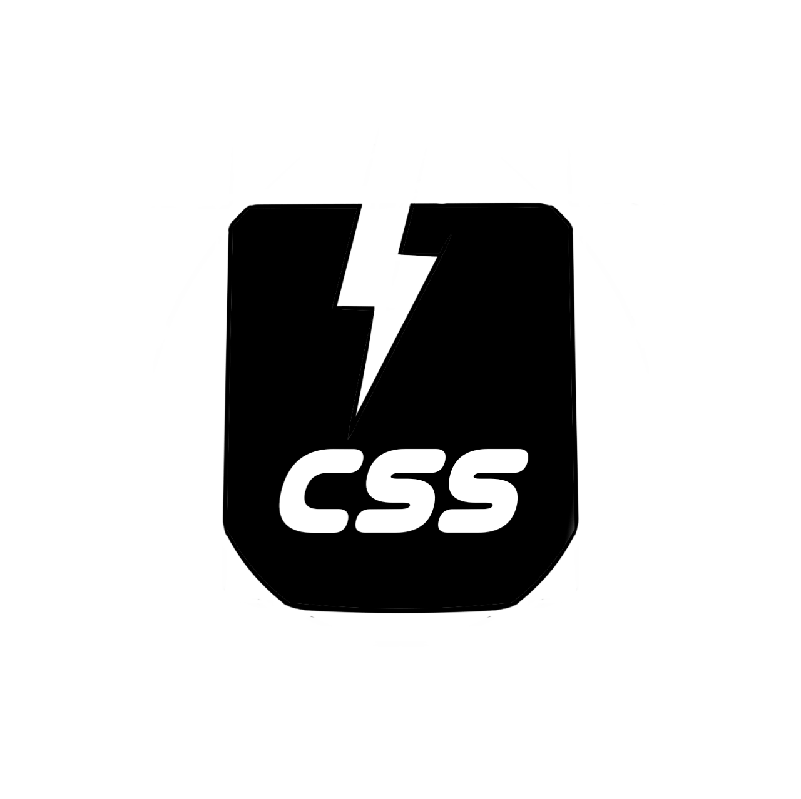

# usecss

A **free** and **Open Source** css framework for the UI in an website ,developer friendly and uesr friendly approch is the goal of this framework. 

right now USE css is **under development**




## why "use-css"?

<li> <b>simple</b> to integrate </li>
<li> one class approach </li>
<li> <b>theme</b> based customization</li>
<li> <b>UI</b> focused </li>
<li> <b>lightweight</b> framework </li>
<li> ready to use at your project without the worry of design</li>


### cdn for testing the USE css framework

- html link 
```
<link rel="stylesheet" type="text/css" href="https://cdn.jsdelivr.net/gh/MANIKANDANMLT/usecss@main/main.css">
```
- cdn link
https://cdn.jsdelivr.net/gh/MANIKANDANMLT/usecss@main/main.css

# integration

its so simple as this

### namings for the themes we offer are real life environment based so its easy to keep those in mind

# themes offered

- forest  (forest based greenish theme)
- lava    (volcano based reddish theme)
- ocean   (sea based bluish theme)
- working on other themes will be **out soon!....**

## forest
```
<body class="forest">
....
</body>
```

## lava
```
<body class="lava">
....
</body>
```

## ocean
```
<body class="ocean">
....
</body>
```

## dark themes
```
<body class="forest dark">
<body class="lava dark">
<body class="ocean dark">
....
</body>
```

### detailed documentation will be updated soon....

thank you :)
